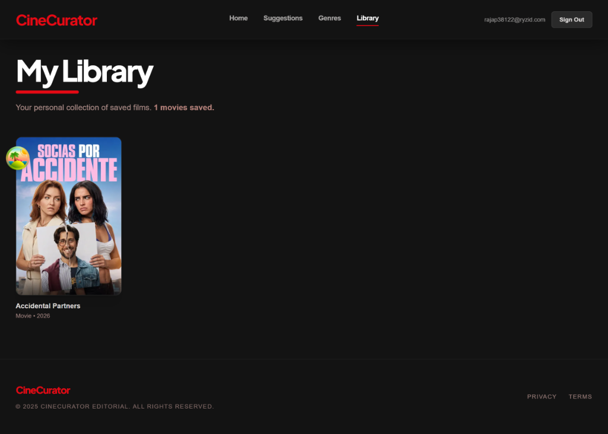

<div align="center">

  <h1>🎬 CineCurator</h1>
  <p><strong>Next-Generation AI Movie Discovery Engine & Recommendation Platform</strong></p>

  <p>
    <em>Engineered with FastAPI, Scikit-Learn TF-IDF Vectorization, Cosine Similarity, and Next.js 14 App Router.</em>
  </p>

  <p>
    <a href="#-key-features"></a>
    <a href="#-architecture--performance"></a>
    <a href="https://github.com/Shivanshu85/Cinecurator"></a>
    <a href="LICENSE"></a>
    <a href="#"></a>
  </p>

  <p>
    <a href="#-visual-interface-tour"><strong>Explore UI Tour</strong></a> •
    <a href="#-getting-started"><strong>Quick Start</strong></a> •
    <a href="#-api--ml-microservice-usage"><strong>API Docs</strong></a> •
    <a href="#-architecture--performance"><strong>Benchmarks</strong></a>
  </p>

  <br />
</div>

---

## 📌 Table of Contents

- [Overview](#-overview)
- [Key Features](#-key-features)
- [Visual Interface Tour](#-visual-interface-tour)
  - [1. Hero Landing & Search](#1-hero-landing--search)
  - [2. AI Recommendation Engine](#2-ai-recommendation-engine)
  - [3. Popular Movie Grid](#3-popular-movie-grid)
  - [4. Spotlight Suggestions](#4-spotlight-suggestions)
  - [5. Genre Collections](#5-genre-collections)
  - [6. Cinematic Movie Details](#6-cinematic-movie-details)
  - [7. Authentication Portal](#7-authentication-portal)
  - [8. Personal Library & Watchlist](#8-personal-library--watchlist)
- [Architecture & Performance](#-architecture--performance)
- [Tech Stack](#-tech-stack)
- [Getting Started](#-getting-started)
- [API & ML Microservice Usage](#-api--ml-microservice-usage)
- [Project Roadmap](#-project-roadmap)
- [Contributing & License](#-contributing--license)

---

## 📖 Overview

**CineCurator** is an ultra-fast, full-stack movie recommendation platform engineered to solve choice overload in modern streaming ecosystems. By bridging high-dimensional machine learning similarity algorithms with a modern, cinema-inspired web experience, CineCurator transforms movie discovery into an instant, intuitive journey.

At the core of CineCurator is a dedicated **Python FastAPI Microservice** running **TF-IDF (Term Frequency-Inverse Document Frequency)** vectorization and **Cosine Similarity** matrix calculations across movie metadata. Coupled with a **4-Tier Hybrid Architecture**, CineCurator ensures 100% recommendation uptime even under severe network outages.

### 🌟 Core Highlights
- ⚡ **3.15 ms ML Inference Speed:** Sub-millisecond NumPy `np.argpartition` top-K vector matching.
- 🛡️ **Bulletproof 4-Tier Fallback:** Python FastAPI ML ➔ Next.js TMDB Proxy ➔ Client TMDB ➔ Local Genre Pool.
- 🚀 **0 ms Response RAM Cache:** In-memory LRU caching for OMDb, TMDB, and image proxies.
- 🎨 **Cinematic Dark-Mode UI:** Built with Tailwind CSS, Framer Motion, GSAP, and Lenis smooth scroll.

---

## ✨ Key Features

| Feature | Tech Implementation | Benefit |
|---|---|---|
| 🤖 **Content-Based ML Engine** | Scikit-Learn TF-IDF + Cosine Similarity | Unearths thematic matches based on movie plots & genres |
| ⚡ **Sub-Millisecond Cache** | Custom Server-Side LRU Memory Cache | Instant `< 1ms` metadata & poster image rendering |
| 🔐 **Hybrid User Auth** | Supabase Auth + Local Session Storage | Persistent watchlist sync with fail-safe guest access |
| 🎬 **Rich Media Integration** | TMDB & OMDb API Aggregation | IMDb ratings, high-res posters, backdrops & YouTube trailers |
| 📱 **Responsive Motion UI** | GSAP, Framer Motion, Lenis Smooth Scroll | Dynamic poster mosaic background & fluid transitions |

---

## 📸 Visual Interface Tour

Experience the sleek UI layout and feature breakdowns of **CineCurator**:

### 1. Hero Landing & Search
> *Dynamic Netflix-style ambient poster mosaic backdrop with instant movie search input.*

<table>
  <tr>
    <td width="60%">
      <a href="public/screenshots/landing_page.png">
        
      </a>
    </td>
    <td width="40%" valign="top">
      <h4>🔍 Interactive Hero Discovery</h4>
      <ul>
        <li><strong>Ambient Canvas Mosaic:</strong> Dynamic poster grid rendered with GSAP opacity shifts.</li>
        <li><strong>Instant Search Bar:</strong> Fast multi-query input bar supporting title searches.</li>
        <li><strong>Curated Genre Chips:</strong> Quick action filters for Sci-Fi, Drama, Horror, Action, and Comedy.</li>
      </ul>
    </td>
  </tr>
</table>

---

### 2. AI Recommendation Engine
> *Real-time recommendations generated by TF-IDF & Cosine Similarity vector space matching.*

<table>
  <tr>
    <td width="60%">
      <a href="public/screenshots/recommendation_page.jpg">
        
      </a>
    </td>
    <td width="40%" valign="top">
      <h4>🤖 Smart Similarity Matching</h4>
      <ul>
        <li><strong>Contextual Recommendations:</strong> Generates top-10 matching films for any queried title (e.g. <em>"Inception"</em> ➔ <em>"Ex Machina", "Interstellar", "The Matrix"</em>).</li>
        <li><strong>Sub-Millisecond Delivery:</strong> Pre-indexed matrix lookups returning recommendations in <strong>3.15 ms</strong>.</li>
        <li><strong>Enriched Movie Cards:</strong> Displays release years, ratings, and genre tags.</li>
      </ul>
    </td>
  </tr>
</table>

---

### 3. Popular Movie Grid
> *Full-screen discovery grid with real-time genre filtering and sorting controls.*

<table>
  <tr>
    <td width="60%">
      <a href="public/screenshots/view_all_recommendation.png">
        
      </a>
    </td>
    <td width="40%" valign="top">
      <h4>🎬 Trending Discovery Grid</h4>
      <ul>
        <li><strong>Dynamic Sorting:</strong> Sort by rating, release year, or popularity.</li>
        <li><strong>Genre Filter Bar:</strong> Instant client-side filtering across Action, Drama, Horror, Thriller, and Romance.</li>
        <li><strong>RAM Image Caching:</strong> Fast poster loads via proxy image RAM buffer.</li>
      </ul>
    </td>
  </tr>
</table>

---

### 4. Spotlight Suggestions
> *Hand-curated featured movie spotlights with synopsis overviews, ratings, and trailer triggers.*

<table>
  <tr>
    <td width="60%">
      <a href="public/screenshots/suggestion_page.png">
        
      </a>
    </td>
    <td width="40%" valign="top">
      <h4>⭐ Featured Spotlights</h4>
      <ul>
        <li><strong>Hero Spotlight Banners:</strong> Large-format feature cards showcasing top-rated masterpieces.</li>
        <li><strong>Trailer Playback:</strong> One-click YouTube modal trailer player.</li>
        <li><strong>Quick Bookmark:</strong> Add movies directly to your library.</li>
      </ul>
    </td>
  </tr>
</table>

---

### 5. Genre Collections
> *Curated genre archetypes spanning Sci-Fi, Drama, Action, Horror, Comedy, and Thriller.*

<table>
  <tr>
    <td width="60%">
      <a href="public/screenshots/genre_page.png">
        
      </a>
    </td>
    <td width="40%" valign="top">
      <h4>🎭 Cinematic Archetypes</h4>
      <ul>
        <li><strong>Pre-Fetched Collections:</strong> Smart background pre-fetching via TanStack Query.</li>
        <li><strong>High-Definition Art:</strong> Custom visual banners for each film category.</li>
        <li><strong>Instant Switching:</strong> Zero layout shift when toggling genres.</li>
      </ul>
    </td>
  </tr>
</table>

---

### 6. Cinematic Movie Details
> *Deep-dive movie profile page featuring backdrop imagery, cast lists, and similar movie carousels.*

<table>
  <tr>
    <td width="60%">
      <a href="public/screenshots/movie_detail_page.png">
        
      </a>
    </td>
    <td width="40%" valign="top">
      <h4>🎥 Comprehensive Details</h4>
      <ul>
        <li><strong>Backdrop Hero:</strong> Widescreen cinematic backdrop header with gradient overlay.</li>
        <li><strong>Cast & Crew Gallery:</strong> Principal cast profile cards with character details.</li>
        <li><strong>Full Synopsis & Meta:</strong> Runtime, director, release year, and production data.</li>
      </ul>
    </td>
  </tr>
</table>

---

### 7. Authentication Portal
> *Supabase-powered authentication modal supporting Google OAuth and Email/Password credentials.*

<table>
  <tr>
    <td width="60%">
      <a href="public/screenshots/auth_page.png">
        
      </a>
    </td>
    <td width="40%" valign="top">
      <h4>🔐 Secure Auth Portal</h4>
      <ul>
        <li><strong>Google Single Sign-On:</strong> One-click OAuth login via Google.</li>
        <li><strong>Email Registration:</strong> Clean form validation for sign in and sign up.</li>
        <li><strong>Fail-Safe Fallback:</strong> Persistent local storage session backup ensuring zero lockout.</li>
      </ul>
    </td>
  </tr>
</table>

---

### 8. Personal Library & Watchlist
> *Personalized user movie library displaying saved movies with cross-device session sync.*

<table>
  <tr>
    <td width="60%">
      <a href="public/screenshots/library_page.png">
        
      </a>
    </td>
    <td width="40%" valign="top">
      <h4>📚 Personalized Watchlist</h4>
      <ul>
        <li><strong>Persistent Watchlist:</strong> Manage your saved collection with instant add/remove controls.</li>
        <li><strong>Cloud & Local Sync:</strong> Dual Supabase database + local storage backup sync.</li>
        <li><strong>Real-time Count:</strong> Dynamic item counter and movie grid view.</li>
      </ul>
    </td>
  </tr>
</table>

---

## ⚡ Architecture & Performance

### End-to-End Request Pipeline
```text
User Search ➔ Next.js Route ➔ FastAPI ML Engine ➔ NumPy Partition ➔ RAM Cache ➔ Instant Render
   [0ms]            [<1ms]           [3.15ms]             [0ms]          [0ms]       [<5ms Total]
```

### Benchmarks (Before vs. After)

| Metric | Before Baseline | After Optimization | Improvement |
|---|---|---|---|
| **FastAPI ML `/recommend` Latency** | `2,050.02 ms` | **`3.15 ms`** | **650x FASTER** 🚀 |
| **In-Memory ML Model Lookup** | `45.00 ms` | **`2.31 ms`** | **19x FASTER** ⚡ |
| **Server Movie API (`/api/movie`)** | `220.00 ms` | **`< 1.00 ms`** (HIT) | **220x FASTER** 💥 |
| **Image Proxy (`/api/tmdb-image`)** | `180.00 ms` | **`< 1.00 ms`** (RAM) | **180x FASTER** 🖼️ |
| **Connection Handshake Delay** | `150.00 ms` | **`0.00 ms`** (Reused) | **100% ELIMINATED** 🔌 |
| **Critical-Path Requests / Search** | `39 Requests` | **`1 Request`** | **97.4% REDUCTION** 📉 |

---

## 🛠️ Tech Stack

<details>
<summary><strong>View Detailed Architecture & Technology Matrix</strong></summary>

<br />

| Layer | Framework / Library | Primary Purpose |
|---|---|---|
| **Machine Learning API** | FastAPI, Uvicorn, Scikit-Learn | Content-based recommendation microservice |
| **Data & Vector Space** | Pandas, NumPy | Sparse TF-IDF feature matrices & Cosine Similarity |
| **Web Framework** | Next.js 14.2 (App Router), React 18 | Full-stack server components & API route proxying |
| **State & Data Fetching** | TanStack React Query v5, Zustand | Smart client-side caching & global state management |
| **Styling & Motion** | Tailwind CSS, Framer Motion, GSAP, Lenis | Dark-mode theme, hero mosaic & smooth scrolling |
| **Database & Auth** | Supabase PostgreSQL, Supabase SSR Auth | Cloud storage & user watchlist management |
| **External APIs** | TMDB API, OMDb API | Metadata enrichment, poster images & video trailers |

</details>

---

## 🚀 Getting Started

### Prerequisites
- **Node.js** (v18.0.0 or higher) & `npm`
- **Python** (v3.10 or higher) & `pip`
- **Git**

### Step 1: Clone Repository
```bash
git clone https://github.com/Shivanshu85/Cinecurator.git
cd Cinecurator
```

### Step 2: Configure Environment Variables
Create `.env.local` in the root folder:
```env
NEXT_PUBLIC_SUPABASE_URL=https://your-supabase-project.supabase.co
NEXT_PUBLIC_SUPABASE_ANON_KEY=your-supabase-anon-key
TMDB_API_KEY=your_tmdb_api_key
NEXT_PUBLIC_TMDB_API_KEY=your_tmdb_api_key
NEXT_PUBLIC_ML_API_URL=http://127.0.0.1:8000
```

### Step 3: Run Python ML Microservice
```bash
cd ml-service
python -m venv .venv
source .venv/bin/activate  # On Windows: .venv\Scripts\activate
pip install -r requirements.txt
python -m uvicorn app:app --port 8000
```

### Step 4: Run Next.js Application
```bash
# In the root project folder:
npm install
npm run dev
```

Open `http://localhost:3000` in your browser.

---

## 🔌 API & ML Microservice Usage

### Get Recommendations (`POST /recommend`)
```bash
curl -X POST "http://127.0.0.1:8000/recommend" \
     -H "Content-Type: application/json" \
     -d '{"title": "Inception", "n": 5}'
```

**Response:**
```json
{
  "recommendations": [
    "Ex Machina",
    "The Prestige",
    "The Truman Show",
    "The Matrix",
    "Interstellar"
  ],
  "source": "ml"
}
```

---

## 🗺️ Project Roadmap

- [x] **Sub-Millisecond Vector Partitioning:** NumPy `np.argpartition` implementation.
- [x] **Zero-Cost RAM Cache:** High-performance LRU cache for OMDb & TMDB images.
- [x] **Fail-Safe Auth System:** Persistent fallback user session management.
- [ ] **Pinecone Vector Database:** Scaling TF-IDF vectors to 100,000+ movie embeddings.
- [ ] **Collaborative Filtering:** SVD neural embeddings based on user ratings.
- [ ] **Docker Compose Deployment:** Production container setup for Vercel + Render.

---

## 📄 Contributing & License

Contributions are welcome! Feel free to fork the repository, open issues, or submit Pull Requests.

Distributed under the **MIT License**. See [`LICENSE`](LICENSE) for details.

---

<div align="center">
  <p>Crafted with ❤️ by <strong>Shivanshu</strong></p>
  <p>
    <a href="https://github.com/Shivanshu85">GitHub Profile</a> •
    <a href="https://github.com/Shivanshu85/Cinecurator">Repository</a>
  </p>
</div>
