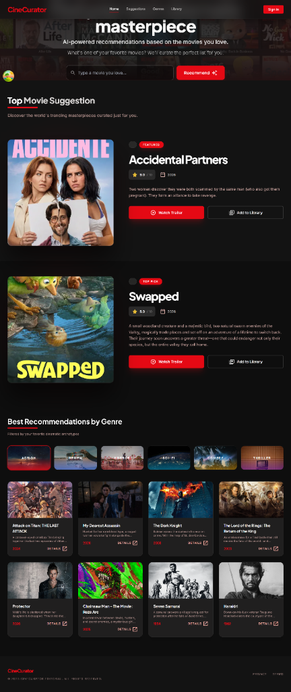
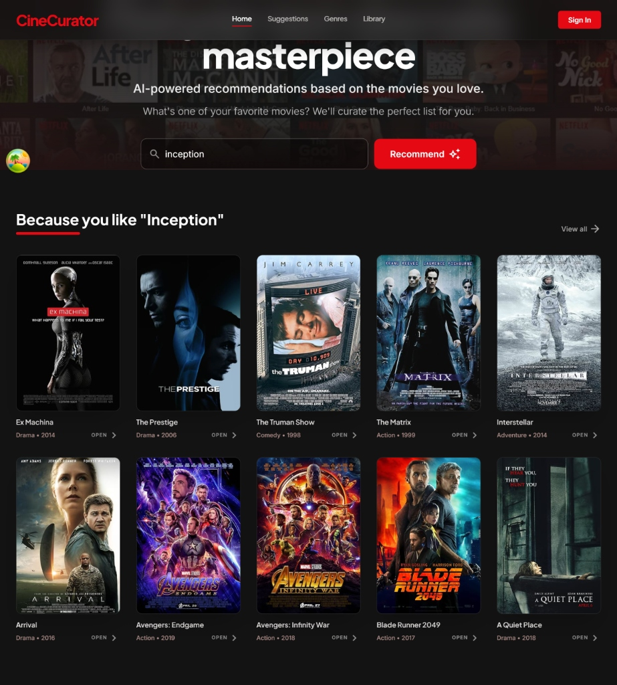
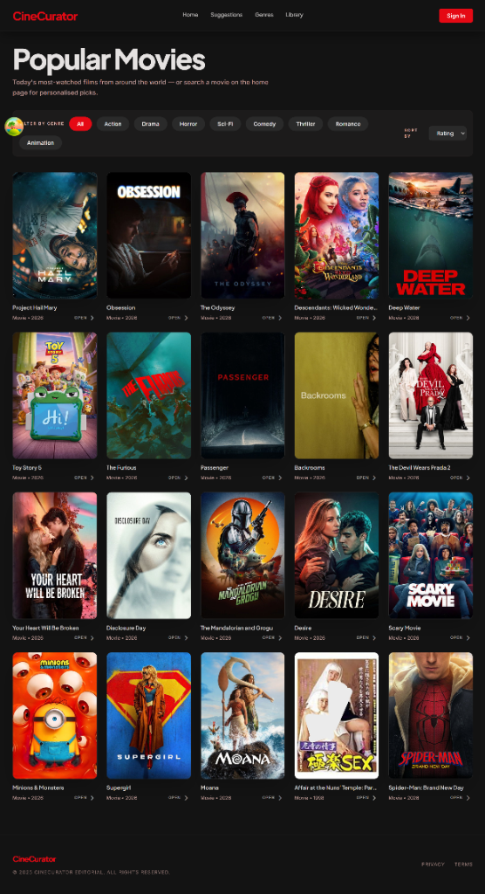
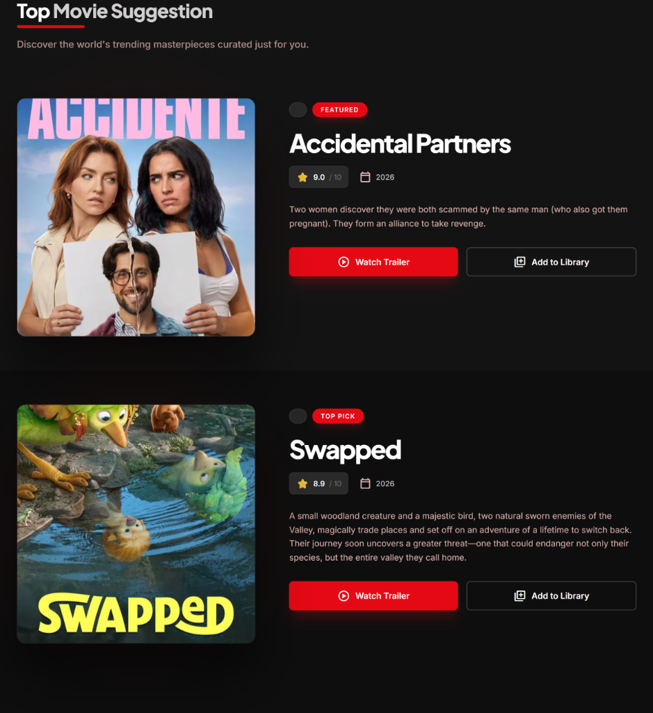
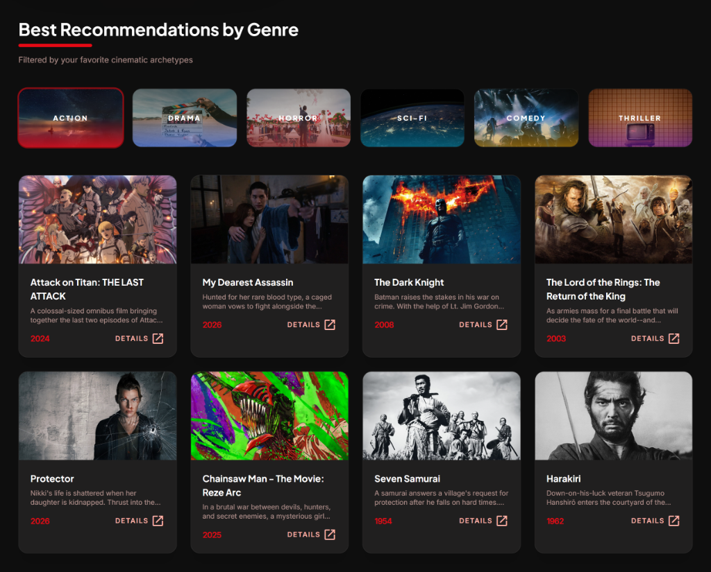
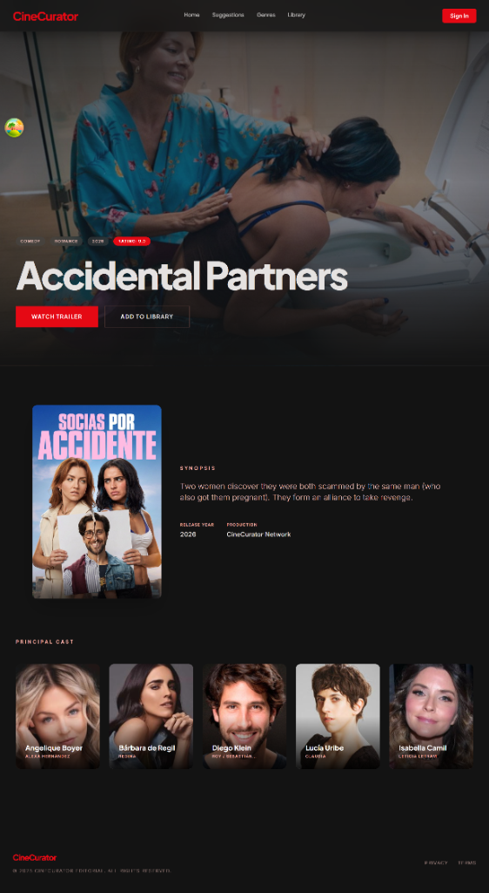
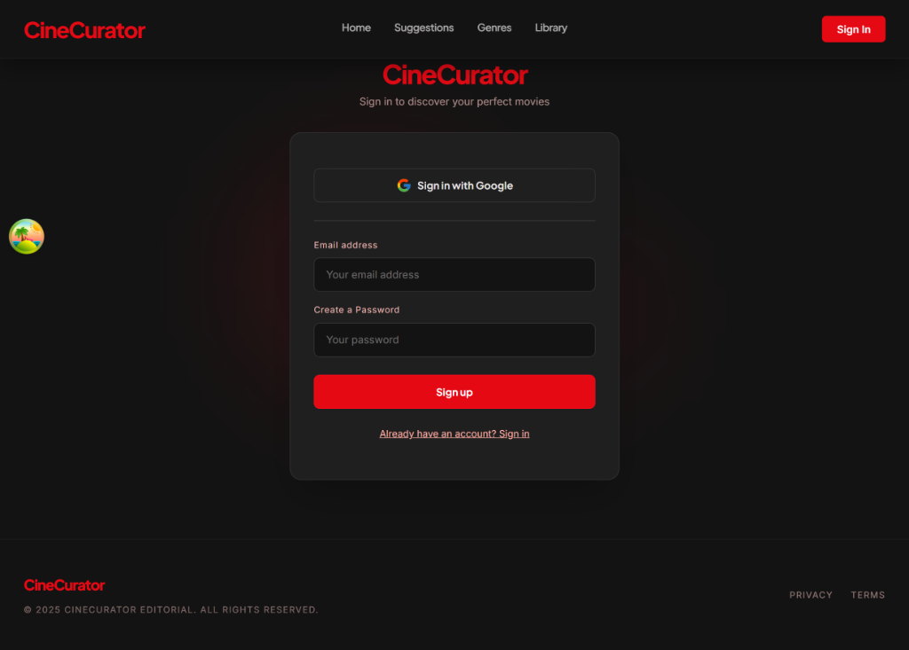

# CineCurator 🎬

> **AI-Powered Movie Discovery Engine delivering personalized film recommendations with TF-IDF Vectorization, Cosine Similarity, and multi-tier API fallbacks.**

[](https://github.com/Shivanshu85/Cinecurator)
[](https://www.python.org/)
[](https://nextjs.org/)
[](https://fastapi.tiangolo.com/)
[](LICENSE)
[](#)

---

## 2. Overview & Visuals

### About the Project
**CineCurator** is an intelligent, full-stack movie recommendation platform engineered to solve the phenomenon of choice paralysis in modern digital entertainment. With thousands of titles scattered across streaming platforms, film enthusiasts often spend more time browsing than watching. CineCurator bridges machine learning recommendation algorithms with a modern, high-performance web architecture to deliver instant, contextual, and highly accurate movie suggestions based on user taste profiles.

At the core of CineCurator's recommendation engine is a dedicated **Python ML Microservice** built with **FastAPI**, **Scikit-Learn**, and **Pandas**. The system processes movie metadata—combining plot overviews, genre classifications, and titles—into a sparse feature matrix using **TF-IDF (Term Frequency-Inverse Document Frequency)** vectorization. By computing **Cosine Similarity** across high-dimensional vector spaces, CineCurator unearths hidden thematic gems and cinematographic matches tailored to any given input movie.

To ensure uncompromised uptime and smooth client operation, CineCurator features a production-ready **4-Tier Hybrid Architecture**:
1. **Python FastAPI ML Service** – Primary TF-IDF & Cosine Similarity recommendation model.
2. **Next.js Server-Side Proxy** – Fallback querying TMDB (The Movie Database) API for server-side similarity lookup.
3. **Client-Side TMDB Fallback** – Direct asynchronous client queries to TMDB by IMDb / TMDB IDs.
4. **Offline Local Genre Matrix** – Embedded, zero-dependency recommendation pool ensuring 100% recommendation reliability even during network outages.

Integrated with **Supabase Authentication** for user watchlist management, **TanStack React Query (v5)** for smart caching, **Zustand** for global UI state, and **Framer Motion / GSAP** for cinematic fluid animations, CineCurator sets a high standard for modern web application engineering.

### Visuals & App Walkthrough

#### 1. Landing Page
*Hero section with Netflix-style poster mosaic background, AI search input bar, featured movie spot, and curated genre lists.*



---

#### 2. Recommendation Engine Page
*Real-time TF-IDF & Cosine Similarity recommendations based on user input (e.g., "Inception").*



---

#### 3. View All Recommendations / Popular Movies Page
*Full-screen movie discovery grid featuring genre filter chips, sorting parameters, and high-resolution posters.*



---

#### 4. Top Movie Suggestion Spotlight Page
*Trending movie suggestions with IMDb ratings, release years, synopsis overviews, trailer playback triggers, and library bookmarking.*



---

#### 5. Best Recommendations by Genre Page
*Curated genre-based recommendation showcase spanning Action, Drama, Horror, Sci-Fi, Comedy, and Thriller archetypes.*



---

#### 6. Movie Detail Page
*Comprehensive movie profile page with cinematic backdrop hero, trailer player triggers, synopsis details, production info, and principal cast members.*



---

#### 7. User Authentication & Sign In / Sign Up Page
*Supabase Auth portal supporting Google OAuth single sign-on and email/password user registration for cross-device watchlist sync.*



---

## 3. Key Features

- 🤖 **TF-IDF & Cosine Similarity ML Model:** Python FastAPI service calculating high-dimensional vector similarity across movie overviews, genres, and titles.
- 🛡️ **4-Tier Bulletproof Fallback System:** Seamless failover pipeline (FastAPI ML Service ➔ Server TMDB ➔ Client TMDB ➔ Local Offline Genre Pool) preventing blank results under any network condition.
- 🔐 **Supabase User Authentication:** Secure user authentication supporting persistent personalized watchlists and favorite movie libraries.
- 🎨 **Cinematic UI with GSAP & Framer Motion:** Modern dark-mode interface featuring dynamic Netflix-style hero poster mosaics, micro-animations, and smooth scrolling via Lenis.
- ⚡ **TanStack React Query Integration:** Optimized client-side caching, background refetching, and genre pre-fetching for instant user feedback.
- 🎬 **Trailer & Rich Metadata Integration:** High-definition poster rendering, backdrop imagery, IMDb/TMDB ratings, plot summaries, and YouTube video trailer embeds.
- 📱 **Fully Responsive Layout:** Designed mobile-first with Tailwind CSS for seamless viewing across smartphones, tablets, and desktop displays.

---

## 4. Tech Stack & Dependencies

### Core Languages
- **Python 3.10+** – Machine Learning API microservice
- **TypeScript & JavaScript (ES6+)** – Type-safe full-stack web application
- **HTML5 & CSS3** – Modern semantic markup and custom styling

### Machine Learning & Backend Microservice
- **FastAPI** – High-performance asynchronous Python web framework
- **Scikit-Learn** – `TfidfVectorizer` and `cosine_similarity` matrix computation
- **Pandas & NumPy** – Fast dataset manipulation and matrix arrays
- **Uvicorn** – ASGI web server implementation
- **Pydantic** – Data validation and schema enforcement

### Web Framework & Frontend
- **Next.js 14.2 (App Router)** – Full-stack React framework with server components & API routes
- **React 18** – UI component library
- **Tailwind CSS & PostCSS** – Utility-first CSS styling
- **Zustand** – Lightweight client state management
- **TanStack React Query v5** – Data fetching, mutation, and intelligent caching
- **Framer Motion & GSAP** – Fluid animations and canvas mosaic effects
- **Lenis** – Smooth scrolling dynamics

### Database & Services
- **Supabase (PostgreSQL & Auth)** – Cloud Database, Authentication, and SSR Client
- **TMDB & OMDb APIs** – Movie metadata, posters, backdrops, and search endpoints

---

## 5. Getting Started (Installation & Setup)

Follow these step-by-step instructions to set up CineCurator on your local environment.

### Prerequisites
- **Node.js** (v18.0.0 or higher) & `npm`
- **Python** (v3.10 or higher) & `pip`
- **Git**
- TMDB API key (optional for server-side TMDB fallback, local fallback works out-of-the-box)

### Step 1: Clone the Repository
```bash
git clone https://github.com/Shivanshu85/Cinecurator.git
cd Cinecurator
```

### Step 2: Environment Configuration
Create a `.env.local` file in the root directory:
```env
# Supabase Configuration (Optional for Auth & Watchlist)
NEXT_PUBLIC_SUPABASE_URL=https://your-supabase-project.supabase.co
NEXT_PUBLIC_SUPABASE_ANON_KEY=your-supabase-anon-key

# TMDB API Configuration
TMDB_API_KEY=your_tmdb_api_key_here
NEXT_PUBLIC_TMDB_API_KEY=your_tmdb_api_key_here

# Python ML Microservice URL
NEXT_PUBLIC_ML_API_URL=http://localhost:8000
```

### Step 3: Setup & Run the Python ML Microservice
Navigate to the `ml-service` directory, set up a virtual environment, and install dependencies:

```bash
# Navigate to ML service directory
cd ml-service

# Create virtual environment
python -m venv .venv

# Activate virtual environment
# Windows (PowerShell):
.venv\Scripts\Activate.ps1
# Linux / macOS:
source .venv/bin/activate

# Install requirements
pip install -r requirements.txt

# Start the FastAPI server with Uvicorn
uvicorn app:app --reload --port 8000
```
*The ML API will start running at `http://localhost:8000` with interactive docs at `http://localhost:8000/docs`.*

### Step 4: Setup & Run the Next.js Frontend
Open a new terminal window in the project root directory:

```bash
# Install frontend dependencies
npm install

# Start Next.js development server
npm run dev
```

Open `http://localhost:3000` in your browser to experience **CineCurator**.

---

## 6. Usage & Examples

### Using the Python ML Microservice (API / CLI)

You can query the FastAPI microservice directly via HTTP requests:

#### Requesting Recommendations (`POST /recommend`)
```bash
curl -X POST "http://localhost:8000/recommend" \
     -H "Content-Type: application/json" \
     -d '{
           "title": "Inception",
           "n": 5
         }'
```

#### API Response
```json
{
  "recommendations": [
    "Interstellar",
    "The Dark Knight",
    "The Matrix",
    "Arrival",
    "Blade Runner 2049"
  ],
  "source": "ml"
}
```

#### Health Check (`GET /health`)
```bash
curl http://localhost:8000/health
```

### Web Application Interaction
1. **Search:** Enter a movie title you enjoy in the hero search bar (e.g., *"Interstellar"* or *"The Godfather"*).
2. **Discover:** CineCurator processes the recommendation request through the FastAPI ML server, retrieving top matching films enriched with posters, plots, and ratings.
3. **Explore Genres:** Click on genre buttons (*Action, Sci-Fi, Thriller, Drama, Horror, Comedy*) to instantly load pre-fetched genre collections.
4. **Watchlist Management:** Log in via Supabase Auth to add films directly to your personalized library.

---

## 7. Dataset Used

CineCurator uses a curated movie dataset containing rich metadata across thousands of popular movie titles.

- **Primary Dataset:** TMDB 5000 / Popular Movies Dataset
- **Fields Processed:** `title`, `genres`, `overview` (plot descriptions), `release_date`, and `vote_average`
- **Pre-processing:** Combined text feature engineering using `TfidfVectorizer(stop_words='english', max_features=5000)` to generate high-dimensional feature vectors.
- **Source Link:** [TMDB 5000 Movie Dataset on Kaggle](https://www.kaggle.com/datasets/tmdb/tmdb-movie-metadata) | [The Movie Database (TMDB) API Documentation](https://developer.themoviedb.org/docs)

---

## 8. Project Roadmap / Future Improvements

- [ ] **Hybrid Collaborative Filtering:** Incorporate Matrix Factorization (SVD) and Neural Collaborative Filtering (NCF) based on user rating histories.
- [ ] **Vector Database Integration:** Migrate TF-IDF similarity vectors to Pinecone or Qdrant for real-time similarity search over 500,000+ movies.
- [ ] **AI Conversational Assistant:** Integrate an LLM-powered chatbot to allow natural language queries (e.g., *"Recommend a mind-bending 90s sci-fi movie with plot twists"*).
- [ ] **Social Watch Parties:** Allow users to create public watchlists and compare movie recommendations with friends.
- [ ] **Dockerization & CI/CD Deployment:** Package the Next.js app and Python FastAPI service using Docker Compose and automate deployments to AWS / Vercel / Render via GitHub Actions.

---

## 9. Contributing & License

### Contributing
Contributions are welcome! If you'd like to improve CineCurator, please follow these steps:

1. **Fork** the Repository
2. **Create** your Feature Branch (`git checkout -b feature/AmazingFeature`)
3. **Commit** your Changes (`git commit -m 'Add some AmazingFeature'`)
4. **Push** to the Branch (`git push origin feature/AmazingFeature`)
5. **Open** a Pull Request

### License
Distributed under the **MIT License**. See `LICENSE` for more information.

---

## 10. Acknowledgments & Contact

### Acknowledgments
- [The Movie Database (TMDB)](https://www.themoviedb.org/) for movie metadata and API endpoints.
- [OMDb API](https://www.omdbapi.com/) for supplemental movie ratings and details.
- [Scikit-Learn](https://scikit-learn.org/) for TF-IDF Vectorization algorithms.
- [Shields.io](https://shields.io/) for repository status badges.

### Contact & Links
- **Author:** Shivanshu
- **GitHub:** [@Shivanshu85](https://github.com/Shivanshu85)
- **Repository:** [https://github.com/Shivanshu85/Cinecurator](https://github.com/Shivanshu85/Cinecurator)
- **Project Link:** [CineCurator Web App](https://github.com/Shivanshu85/Cinecurator)
